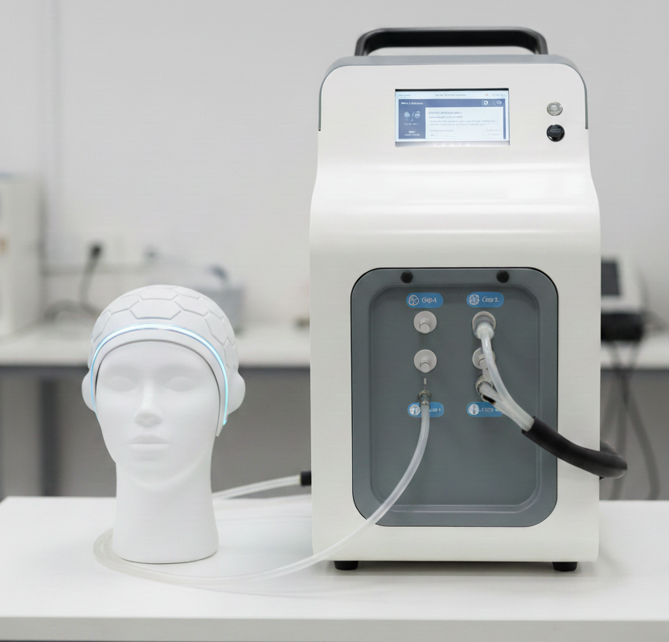
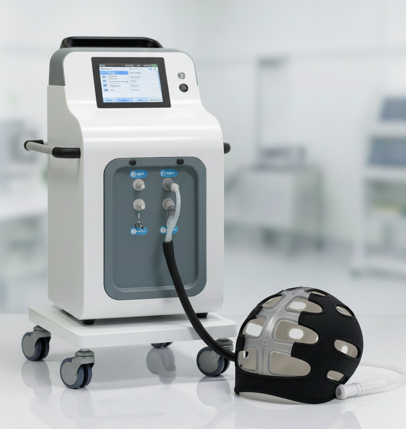
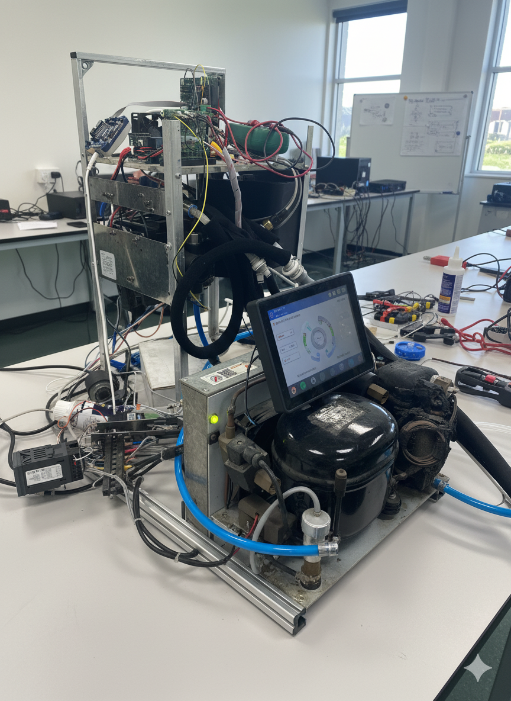

# 🧊 Scalp Cooling System — Dual‑Patient

---

A compact, dual‑patient **scalp cooling controller** that maintains precise scalp temperature during chemotherapy to reduce hair loss.

- [🧊 Scalp Cooling System — Dual‑Patient](#-scalp-cooling-system--dualpatient)
  - [Features](#features)
  - [Hardware](#hardware)
  - [Demo](#demo)

  

## Features

- Independent pump control for 2 patients  
- Non‑PID compressor control to maintain a temperature range
- Multi‑level alarms and automatic safety shutdown  
- Real‑time monitoring of temperature, pressure, and flow  
- UART telemetry with live Python plots and CSV data logging

  

## Hardware

| Component | Description |
|------------|--------------|
| MCU | STM32G030C8 (ARM Cortex‑M0+) |
| Sensors | Temperature, flow, and pressure |
| Actuators | Compressor, pump, solenoid valves |
| Interface | UART for data streaming |
| Tools | STM32CubeIDE, CubeMX, Python (matplotlib, pandas) |

  

## Demo

https://github.com/user-attachments/assets/61aa7489-9105-4390-ae82-b809af393d0d

---

> ⚠️ Firmware code not included due to partner IP agreement.  
> This repository highlights the system design, control strategy, and data handling approach.
